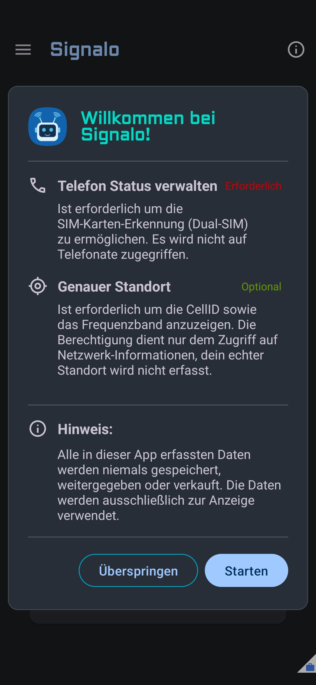
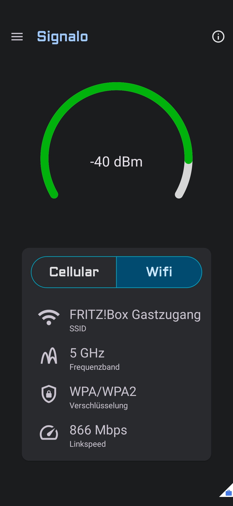
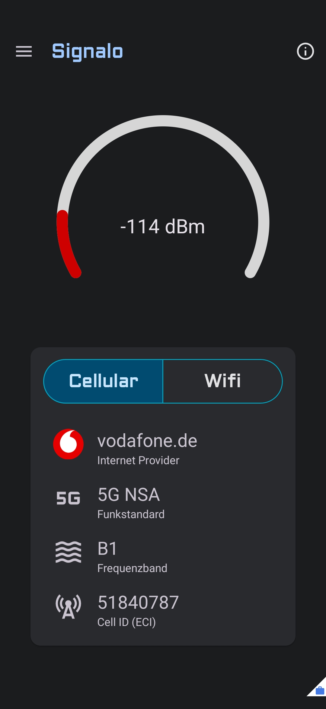

<h1>
  <a href="#">
    
  </a>
  <br>
  Signalo
</h1>

[![Made with love by it@M][made-with-love-shield]][itm-opensource]

**Signalo** is a native Android app which enables users to monitor live network stats of their
device. The main purpose is to view the Signal Strength (dBm) for both Cellular and Wifi in a gauge
graph.

## Screenshots
<p>
  
  
  
</p>

## Built With
Native Android development with Kotlin and XML

**Used Libraries**

* [better-gauge-android](https://github.com/Magnus987/better-gauge-android/tree/Signalo)
* [Material Components](https://github.com/material-components)
* [timber](https://github.com/JakeWharton/timber)
## Set up

1. Clone the repository:
```bash
    git clone https://github.com/it-at-m/signalo.git
```

2. Clone the required [gauge library](https://github.com/Magnus987/better-gauge-android/tree/Signalo) and copy the "gaugelibrary" folder into your root project structure.

3. If you like, change the App ID in `build.gradle.kts` to your own.

4. Open the project in your preferred IDE, sync Gradle, and build.
## Documentation
The main purpose is to view the Signal Strength (dBm) for both Cellular and Wifi in a gauge
graph. But also some extra stats are displayed:

**Cellular**

* Internet Provider
* Network Type
* Frequency Band
* Cell ID (ECI)

**Wifi**

* SSID
* Frequency Band
* Encryption
* Linkspeed

**Supported Features**

* Manual Wifi Refresh
    * A swipe down on the Wifi page triggers a manual Wifi refresh which directly asks the Android
      system to rescan to receive the newest and most precise Signal Strength values.
* Dual-SIM Support
    * When the app detects 2 usable SIM cards, it switches the view to not only display a button for
      Cellular but for SIM1 and SIM2, so the user can choose which SIM to use and compare.
* Single-SIM Detection
    * When the app finds no usable SIM cards, it automatically switches the view to Wifi and
      disables the Cellular page.


**Technical details**

* Signal Strength (dBm)
    * **dBm** (decibel-milliwatts) measures the absolute power level of a signal relative to 1
      milliwatt (mW). The closer the value is to 0, the stronger the signal. Every 3 dBm the signal
      strength is doubled or halved.
    * **Cellular** dBm value is requested via a Callback, which means the value should always be the
      most accurate value your device offers.
    * **Wifi** dBm value is manually requested each second. But due to energy saving reasons the
      Android system is lazy when it comes to offering an accurate value over time. That's why a
      manual Wifi refresh is possible as mentioned above.
    * **Gauge (visualization)** is an open-source library which I forked to optimize things for
      Signalo. It makes it easier to understand if the signal is getting better or worse. It also
      has 3 different color ranges (green, yellow, red) which can be adjusted to the desired
      threshold.
* **Cellular**
    * All cellular data is requested via the TelephonyManager registered on the selected SIM.
        * Internet Provider
            * Name and logo of the internet provider from your connected cell tower. So if you have a
              SIM from Telekom but it connects you to an A1 cell tower, the app shows A1.
        * Network Type
            * Name and logo of the used cellular technology. If it differs from your system's display,
              it's probably because of marketing ;) Android shows that you are connected via 5G but in
              reality it's 5G NSA (Non Standalone) which means your device uses 5G for data but still
              relies on a 4G/LTE anchor for connection management – true standalone 5G (SA) operates
              entirely on 5G infrastructure.
        * Frequency Band
            * Frequency bands are displayed with their standard 3GPP prefix: B for LTE bands and n for
              5G NR bands.
            * Access fine location permission is needed to display this value.
            * Read Phone state permission is needed to display this value.
        * Cell ID (ECI)
            * The ECI (E-UTRAN Cell Identifier) uniquely identifies the cell you're connected to. It's
              unique within your country and your provider.
            * Access fine location permission is needed to display this value.
            * Read Phone state permission is needed to display this value.


* **Wifi**
    * All Wifi data is received from the WifiInfo object from the ConnectivityManager.
        * SSID
            * The current Wifi name (SSID) is displayed as a string.
            * Access fine location permission is needed to display this value.
        * Frequency Band
            * The used frequency band is displayed (5 GHz or 2.4 GHz).
        * Encryption
            * The encryption standard of the connected Wifi is displayed (e.g. WPA3).
        * Linkspeed
            * The link speed of the connected Wifi is displayed in Megabits per second.


## Contributing

Contributions are what make the open source community such an amazing place to learn, inspire, and create. Any contributions you make are **greatly appreciated**.

If you have a suggestion that would make this better, please open an issue with the tag "enhancement", fork the repo and create a pull request. You can also simply open an issue with the tag "enhancement".
Don't forget to give the project a star! Thanks again!

1. Open an issue with the tag "enhancement"
2. Fork the Project
3. Create your Feature Branch (`git checkout -b feature/AmazingFeature`)
4. Commit your Changes (`git commit -m 'Add some AmazingFeature'`)
5. Push to the Branch (`git push origin feature/AmazingFeature`)
6. Open a Pull Request

More about this in the [CODE_OF_CONDUCT](/CODE_OF_CONDUCT.md) file.


## License

Distributed under the MIT License. See [LICENSE](LICENSE) file for more information.


## Contact

it@M - opensource@muenchen.de

<!-- project shields / links -->
[made-with-love-shield]: https://img.shields.io/badge/made%20with%20%E2%9D%A4%20by-it%40M-yellow?style=for-the-badge
[itm-opensource]: https://opensource.muenchen.de/